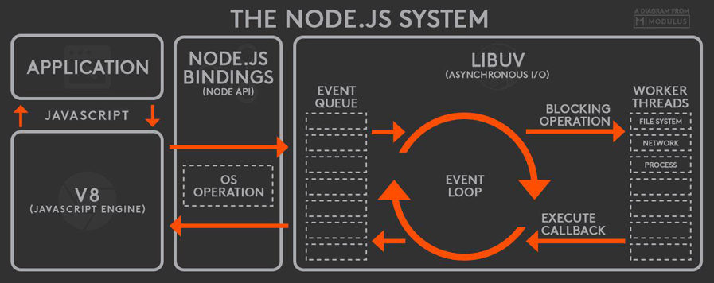

# Node.js学习笔记

### nvm更新Node.js版本
1. macOS或Linux的[nvm](https://github.com/creationix/nvm)：

    ```bash
    nvm list-remote
    nvm install v新版本号
    nvm use v新版本号
    nvm alias default v新版本号

    nvm list
    nvm uninstall v旧版本号     # 如果无法删除，可以去目录删除 /Users/用户名/.nvm/versions/node/v版本
    ```
2. Windows的[nvm-windows](https://github.com/coreybutler/nvm-windows)：

    >安装nvm-windows时，需要删除原本安装在电脑上的Node.js。

    ```bash
    nvm node_mirror https://npm.taobao.org/mirrors/node/    #设置node源：
    nvm npm_mirror https://npm.taobao.org/mirrors/npm/      #设置npm源：

    nvm list available
    nvm install v新版本号
    nvm use v新版本号

    nvm list
    nvm uninstall v旧版本号     # 还可以再去目录中删除 C:\Users\用户名\AppData\Roaming\nvm\v版本
    ```

>切换版本之后需重装Node.js的全局模块包。

### Node.js的运行机制:
1. V8引擎解析JS脚本。
2. 解析后的代码，调用Node API。
3. [libuv](https://github.com/libuv/libuv)负责Node API的执行。将不同的任务分配给不同的线程，形成一个Event Loop（事件循环），以异步的方式将任务的执行结果返回给V8引擎。
4. V8引擎再将结果返回给用户。



### npm
1. 命令

    1. 登录

        `npm login`
    2. 初始化`package.json`

        `npm init --yes`
    3. 发布

        `npm publish`
    4. 升级npm自己

        `npm install -g npm`
2. 安装包

    1. 作用域

        1. 本地：在本地被`require`引入后使用。
        2. 全局：在命令行中使用。
    2. 安装方式

        1. `package.json`（`npm install`）

            >`主版本号.次版本号.补丁号`，详细定义查看[Semantic](http://semver.org/lang/zh-CN/)。

            安装时自动选择相对最新版本号。

            1. 最新（主版本号最新）：

                `*`、`x`
            2. 次版本号最新：

                `1`、`1.x`、`^1.2.3`
            3. 补丁号最新：

                `1.2`、`1.2.x`、`~1.2.3`
            4. 确定的版本：

                `1.2.3`
        2. `npm install 包`

            1. 没有后缀，则最新版
            2. `@版本`

                1. 具体版本号
                2. `latest`
                3. 版本范围：`>`、`>=`、`<`、`<=` + 版本号
3. `package.json`

    1. `dependencies`

        生产环境依赖。
    2. `devDependencies`

        开发、测试依赖。

        >- 何时不被安装：
        >
        >    1. 项目不会安装依赖库的`devDependencies`。
        >    2. `NODE_ENV`值为`production;`时，项目不会安装自己的`devDependencies`。
        >
        >        >`export NODE_ENV=production;`。
        >    3. `npm install --production`不会安装自己的`devDependencies`。
4. 包的制作-使用

    1. 制作：
    
        按照[CommonJS规范](https://github.com/realgeoffrey/knowledge/blob/master/网站前端/Node.js学习笔记/README.md#commonjs规范)编写代码。
    2. 使用：
    
        1. 在Node.js环境下使用（`require`）

            >如`vue-cli`。
        2. 在浏览器环境下使用

            1. 用打包工具（`webpack`、`browserify`、`rollup`）打包成能够在浏览器运行的JS代码。
            2. 直接制作可兼容在浏览器环境运行的代码。

            >如`Vue.js`。

### CommonJS规范
>参考[阮一峰：require() 源码解读](http://www.ruanyifeng.com/blog/2015/05/require.html)、[阮一峰：CommonJS规范](http://javascript.ruanyifeng.com/nodejs/module.html)。

- 概述

    1. 模块的加载实质上是：注入`exports`、`require`、`module`三个全局变量；执行模块的源码；将模块的`exports`变量的值输出。
    2. 每个文件就是一个模块，有自己的作用域，不会污染全局作用域。在一个文件里定义的变量、函数、类，都是私有的，对其他文件不可见。
    3. 模块可以多次加载，但是只会在第一次加载时运行一次，然后运行结果就被缓存了，以后再加载，就直接读取缓存结果。要想让模块再次运行，必须清除缓存。
    4. 模块加载的顺序，按照其在代码中出现的顺序。

1. `require(X)`

    加载模块。读取并执行一个JS文件，返回该模块的`exports`对象。

    1. 如果 X 是内置模块（如`require('http')`），返回该模块，不再继续执行。
    2. 如果 X 以`/`、`./`或`../`开头

        1. 根据 X 所在的父模块，确定 X 的绝对路径。
        2. 将 X 当成**文件**，依次查找下面文件，只要其中有一个存在，就返回该文件，不再继续执行。

            `X`、`X.js`、`X.json`、`X.node`
        3. 将 X 当成**目录**，依次查找下面文件，只要其中有一个存在，就返回该文件，不再继续执行。

            `X/package.json（main字段）`、`X/index.js`、`X/index.json`、`X/index.node`
    3. 如果 X 不带路径

        1. 根据 X 所在的父模块，确定 X 可能的安装目录。
        2. 依次在每个目录中，将 X 当成**文件**或**目录**加载。
    4. 抛出`not found`。

    >e.g.
    >
    >- 在`/home/ry/projects/foo.js`执行了`require('bar')`：
    >
    >    1. 判断不是内置模块，属于不带路径情况；
    >    2. 依次搜索每一个目录：
    >
    >        ```text
    >        /home/ry/projects/node_modules/
    >        /home/ry/node_modules/
    >        /home/node_modules/
    >        /node_modules/
    >        ```
    >
    >        1. 搜索时，先将`bar`当作文件名，依次在`某某/node_modules/`尝试加载下面文件：
    >
    >            `bar`、`bar.js`、`bar.json`、`bar.node`
    >        2. 如果都不成功，说明`bar`可能是目录名，依次在`某某/node_modules/`尝试加载下面文件：
    >
    >            ```text
    >            bar/package.json（main字段）
    >            bar/index.js
    >            bar/index.json
    >            bar/index.node
    >            ```
    >    3. 都找不到则抛出`not found`。
2. `exports`

    向其添加属性作为模块输出的内容。

    >`exports === module.exports`。
3. `module`

    - 当前模块对象。拥有以下属性：

        1. `module.id`：模块的识别符，通常是带有绝对路径的模块文件名。
        2. `module.filename`：模块的文件名，带有绝对路径。
        3. `module.loaded`：返回一个布尔值，表示模块是否已经完成加载。
        4. `module.parent`：返回一个对象，表示调用该模块的模块。
        5. `module.children`：返回一个数组，表示该模块要用到的其他模块。
        6. `module.exports`：表示模块对外输出的值。
        7. `module.paths`：返回一个数组，模块文件默认搜索目录（`某某/node_modules/`）。

    >所有模块都是Node内部`Module`构建函数的实例。